## Part 1. Удаленное конфигурирование узла через Ansible


1) Создадим с помощью Vagrant три машины - manager, node01, node02. Прокинем порты node01 на локальную машину для доступа к пока еще не развернутому микросервисному приложению.  
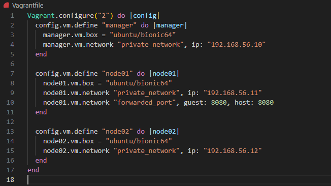

2) Подготовим manager как рабочую станцию для удаленного конфигурирования.
    1) Зайдем на manager ```vagrant ssh manager```, сгенерируем ssh-ключи для manager ```ssh-keygen -t rsa -b 2048 -N "" -f ~/.ssh/id_rsa```, с помощью ```ssh-copy-id -i id_rsa.pub 192.168.56.11``` скопируем наш публичный ключ на node01.  
    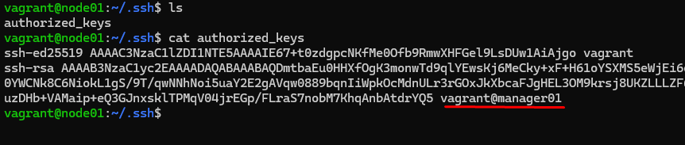
    2) Установим Ansible на менеджер и создадим папку ansible, в которой создадим inventory-файл. Используем модуль ping для проверки подключения через Ansible.
    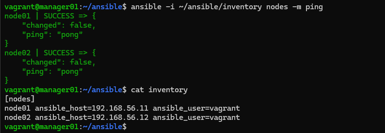
    3) Скопируем на manager docker-compose файл и исходный код микросервисов ```vagrant scp <some_local_file_or_dir> [vm_name]:<somewhere_on_the_vm>``` . (Используя проект из папки src и docker-compose файл из предыдущей главы.)  
    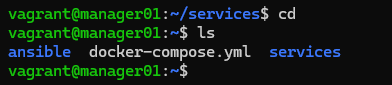

3) Напишем первый плейбук для Ansible, который выполняет apt update, устанавливает docker, docker-compose, копирует compose-файл из manager'а и разворачивает микросервисное приложение.  
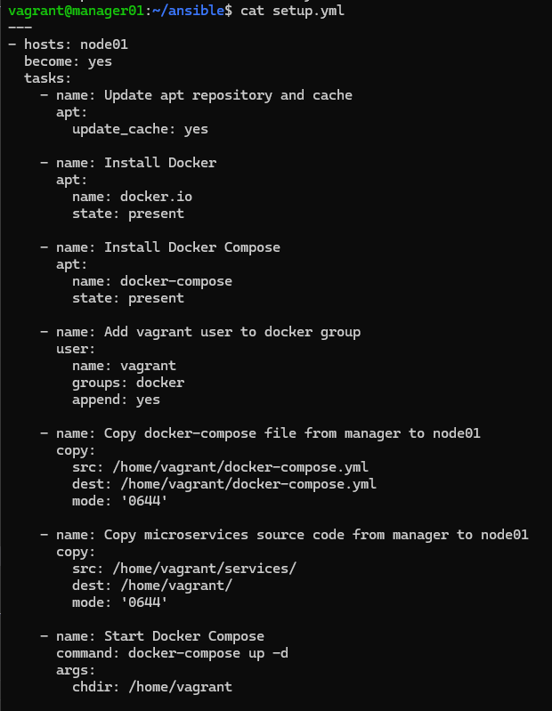

4) С помощью команды ```ansible-playbook -i ~/ansible/inventory ~/ansible/setup.yml``` запустим написанный плейбук.
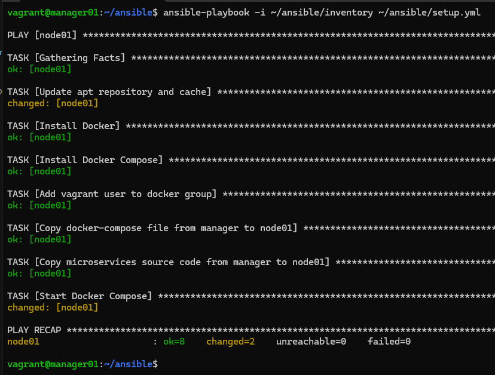

5) На машине node01 проверим все ли работает ```docker ps``` and ```ls```.  
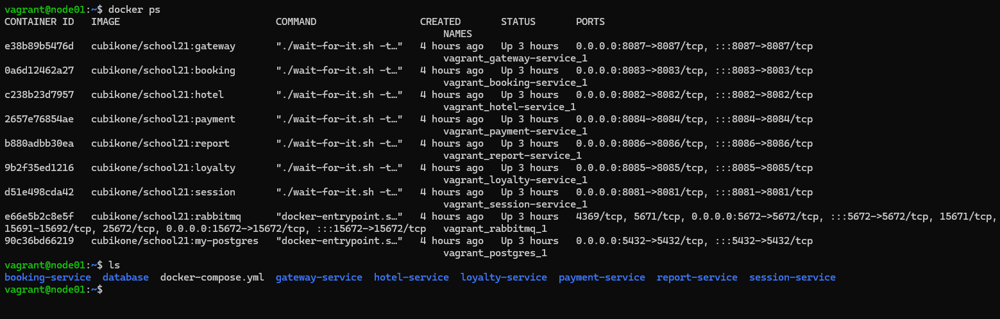

6) Прогоним заготовленные тесты через postman и удостоверимся, что все они проходят успешно.  
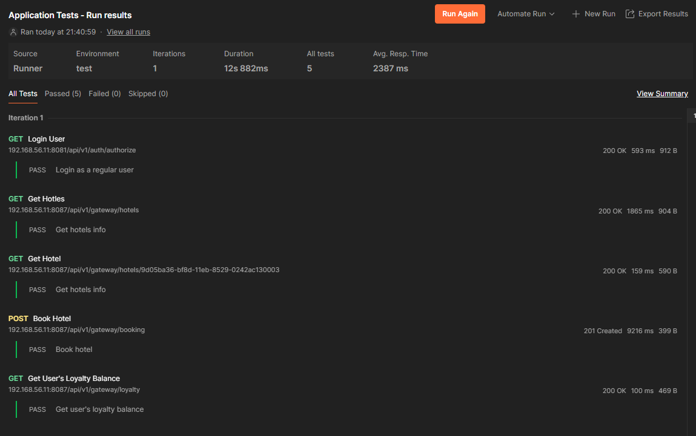

7) Сформируем три роли:
    1) роль application выполняет развертывание микросервисного приложения при помощи docker-compose,
    2) apache устанавливает и запускает стандартный apache сервер
    3) postgres устанавливает и запускает postgres, создает базу данных с произвольной таблицей и добавляет в нее три произвольные записи.

8) Для этого в папке ansible создадим папки для ролей и задач для них 
    1) mkdir -p ~/ansible/roles/application/tasks
    2) mkdir -p ~/ansible/roles/apache/tasks
    3) mkdir -p ~/ansible/roles/postgres/tasks  
    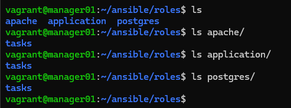

9) Для каждой роли распишем свои задачи в соответствующих файлах(сами файлы можно найти в /src/ansible01).

10) Создадим плейбук для применения ролей.  
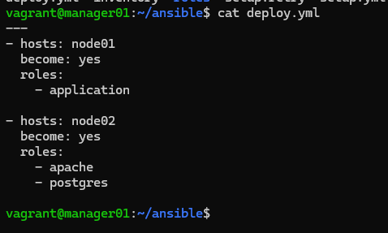

11) Запустим плейбук ```ansible-playbook -i ~/ansible/inventory ~/ansible/deploy.yml``` 
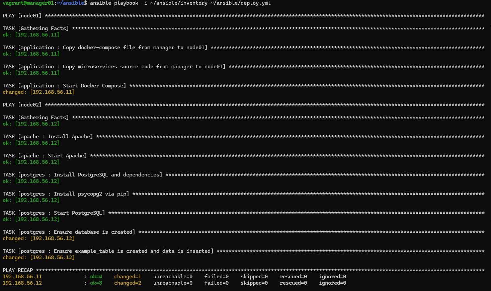

11) Перейдем к тестам: 
    1) Тесты Postman  
    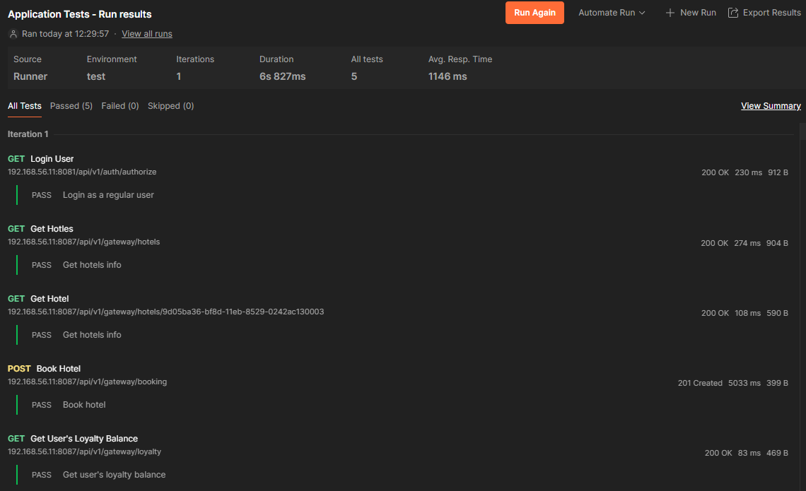
    2) Тесты Apache(откроем в браузере веб-страницу и получим стартовую страницу apache)  
    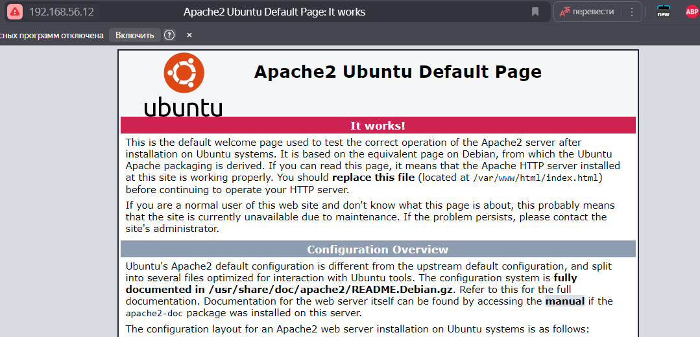
    3) Подключимся к node02 и проверим создалась ли база данных.  
    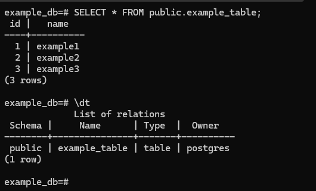


## Part 2. Service Discovery

1) Напишем два конфигурационных файла для consul:  
    1) consul_server.hcl  
    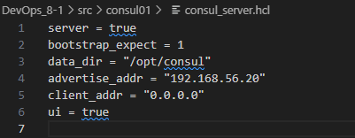
    2) consul_client.hcl  
    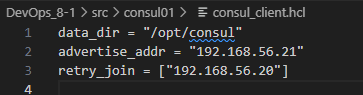

2) Создадим с помощью Vagrant три машины - consul_server, api и db.  
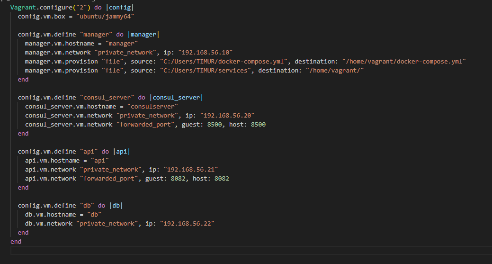

3) Напишем плейбук для ansible и четыре роли (файлы можно найти в src/consul01 и src/ansible02)

4) Запустим наш плейбук  
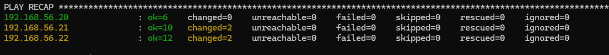

5) Убедимся что на нашей машине api сервис запустился  
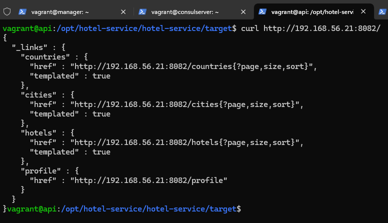